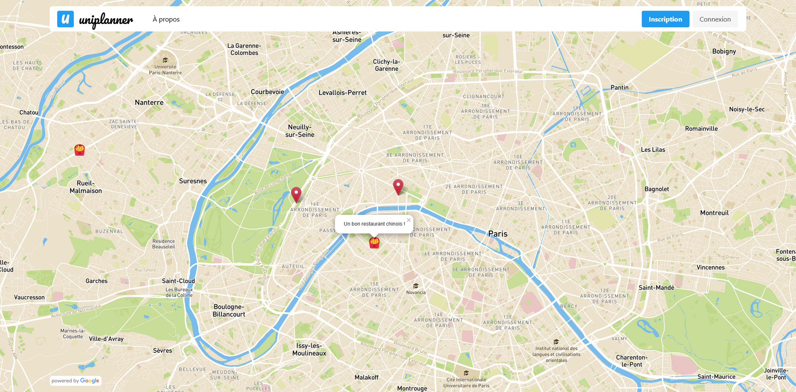

# uniplanner

Uniplanner est un projet étudiant de carte communautaire permettant à ses utilisateurs d'ajouter sur la carte des bons plans autour de leurs écoles.

Outils utilisés : Leaflet, leaflet-color-markers par pointhi, Mapbox, Firebase, Bulma, Bulma Toast par rfoel.

Projet réalisé par Fabien Rondan, Hassen Arkab et Ryan Malonzo dans le cadre du module de PWEB, année universitaire 2021 - 2022 à l'IUT de Paris Cité.
